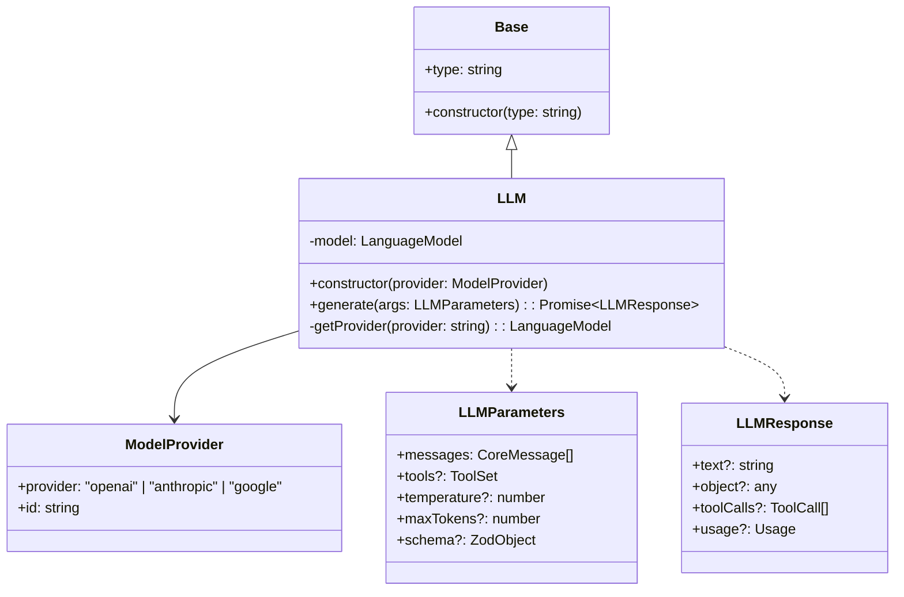
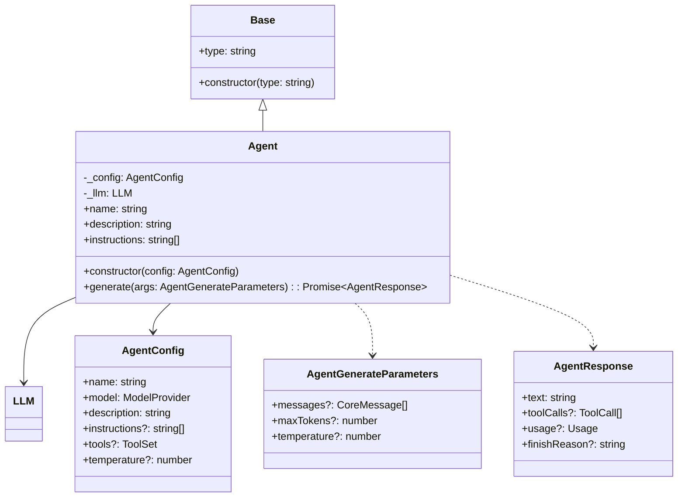
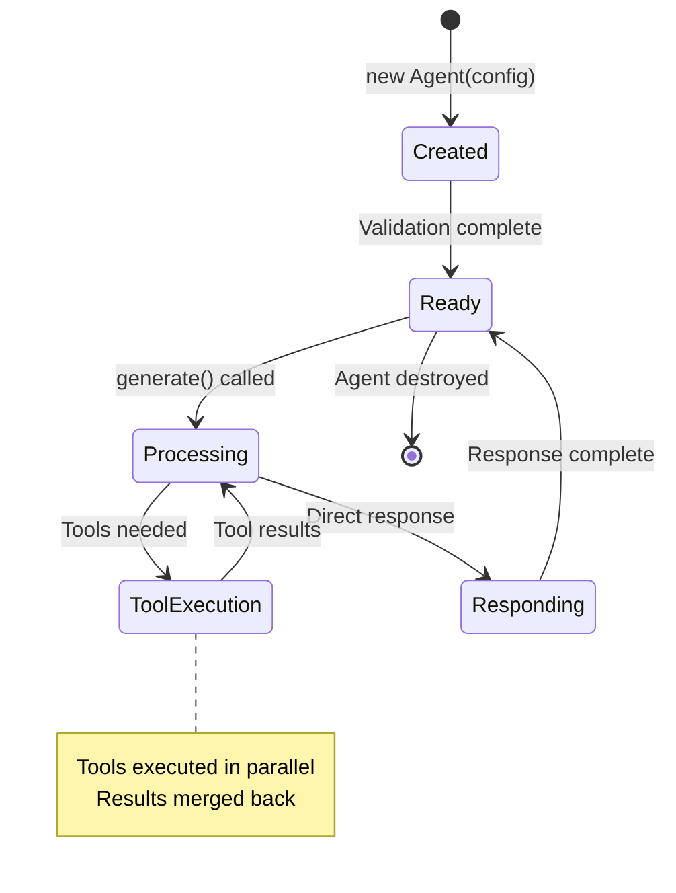
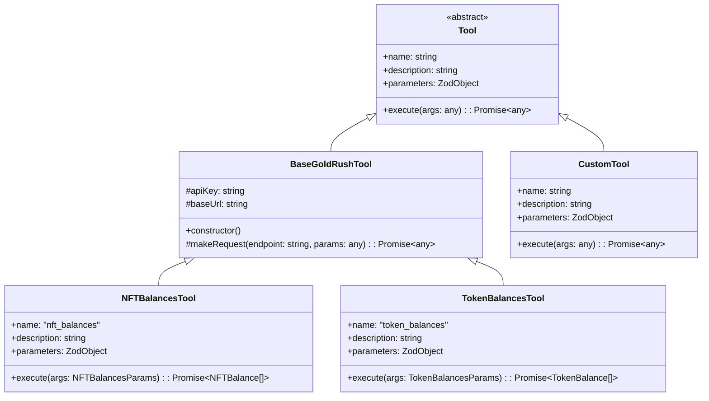
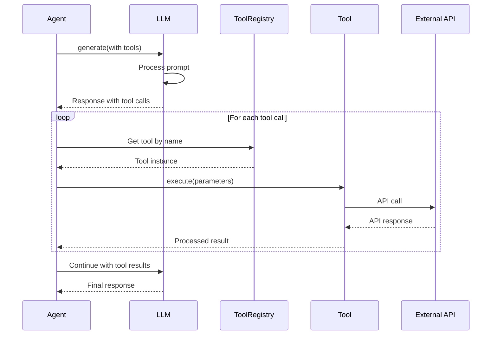
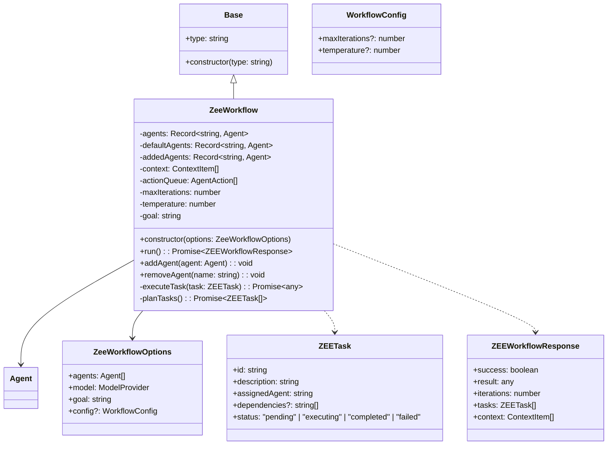
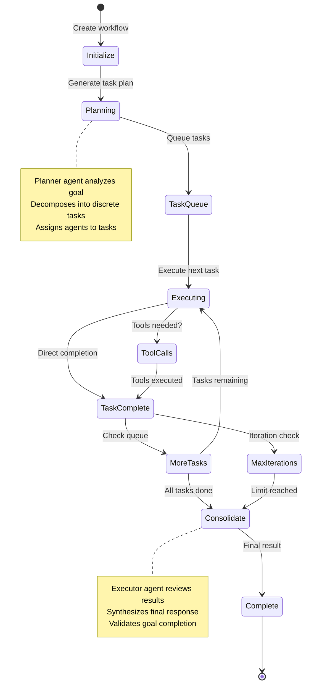
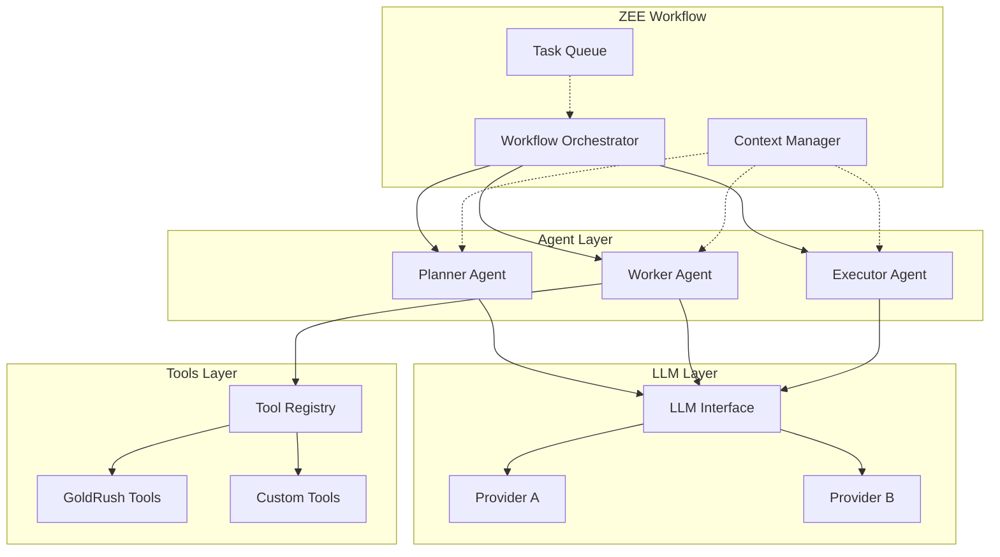

# Component Architecture

This document provides detailed technical architecture for each core component of the AI Agent SDK.

## LLM Interface Architecture

The LLM component provides a unified interface across different AI providers.



### Provider Integration

```mermaid
graph TB
    subgraph "LLM Interface"
        LLM[LLM Class]
        Config[Provider Config]
    end
    
    subgraph "AI SDK Providers"
        OpenAI[@ai-sdk/openai]
        Anthropic[@ai-sdk/anthropic]
        Google[@ai-sdk/google]
    end
    
    subgraph "External APIs"
        OpenAIAPI[OpenAI API]
        AnthropicAPI[Anthropic API]
        GoogleAPI[Google AI API]
    end
    
    LLM --> Config
    Config --> OpenAI
    Config --> Anthropic
    Config --> Google
    
    OpenAI --> OpenAIAPI
    Anthropic --> AnthropicAPI
    Google --> GoogleAPI
```

## Agent Architecture

Agents encapsulate AI models with specific behaviors and capabilities.



### Agent Lifecycle



## Tools System Architecture

The tools system provides extensible capabilities for agents.



### Tool Execution Flow



## ZEE Workflow Architecture

ZEE Workflows orchestrate multiple agents to solve complex problems.



### Workflow Execution Engine



## Inter-Component Communication



This component architecture ensures loose coupling, high cohesion, and clear separation of concerns across the entire SDK.