# Data Flow Patterns

This document details how data flows through the AI Agent SDK, from user input to final output, including transformation patterns and state management.

## Overall Data Flow

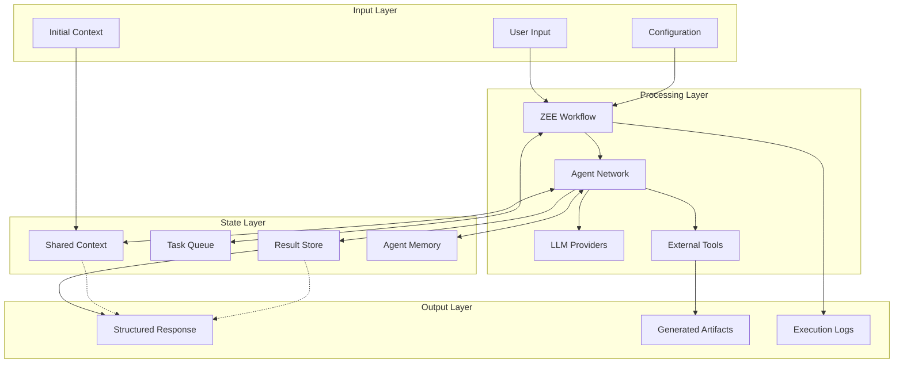

## Message Flow Patterns

### Single Agent Flow

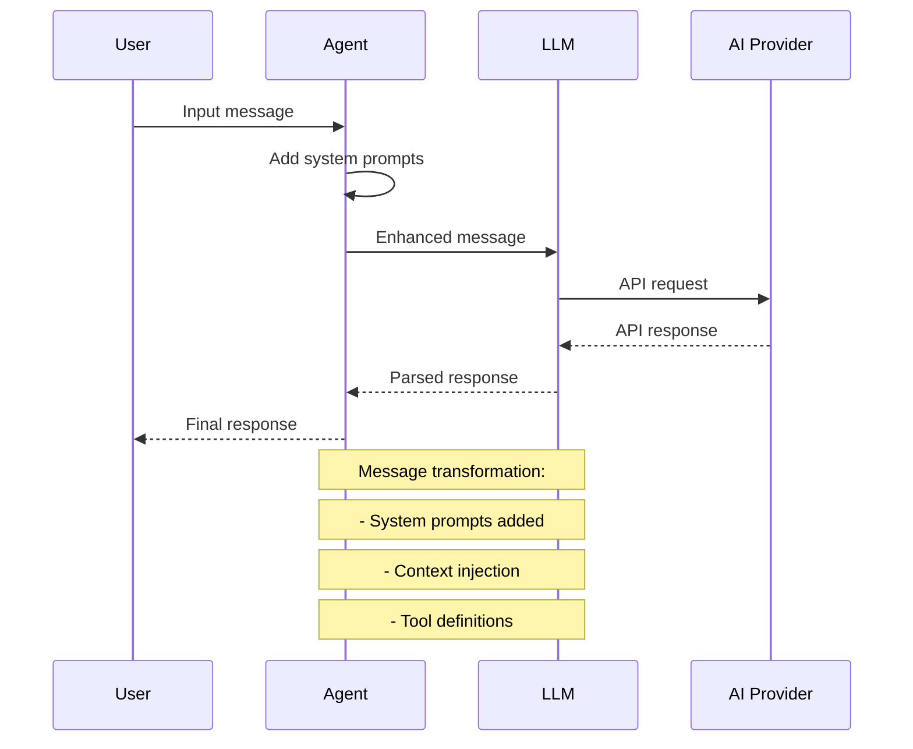

### Multi-Agent Workflow Flow

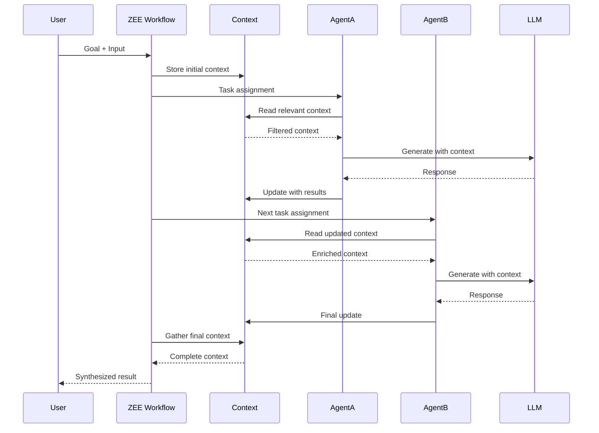

## Data Transformation Pipeline

### Input Processing

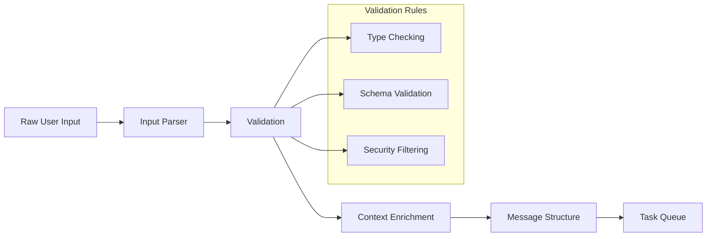

### Message Transformation

Messages undergo multiple transformations as they flow through the system:

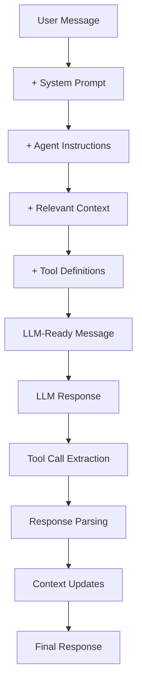

### Tool Integration Flow

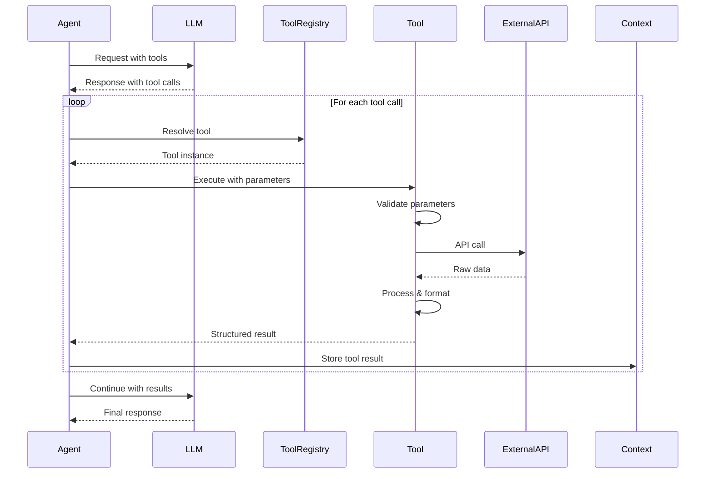

## Context Management Flow

### Context Lifecycle

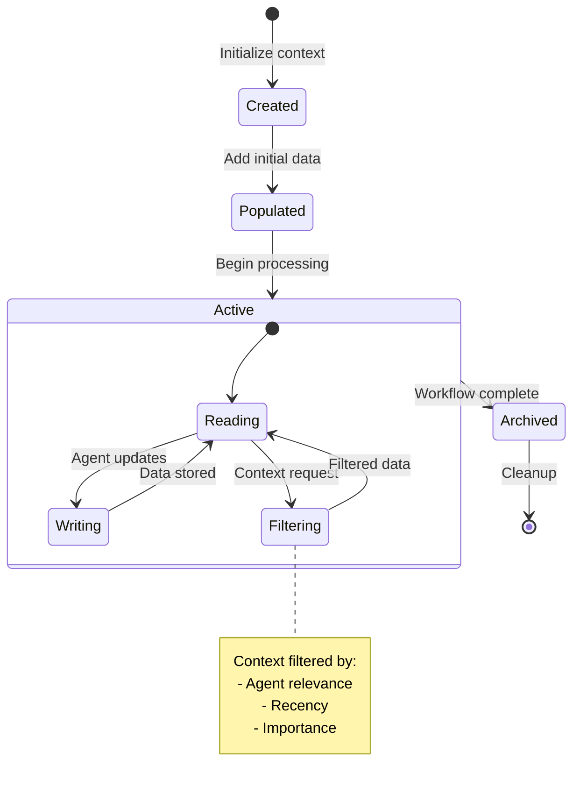

### Context Propagation

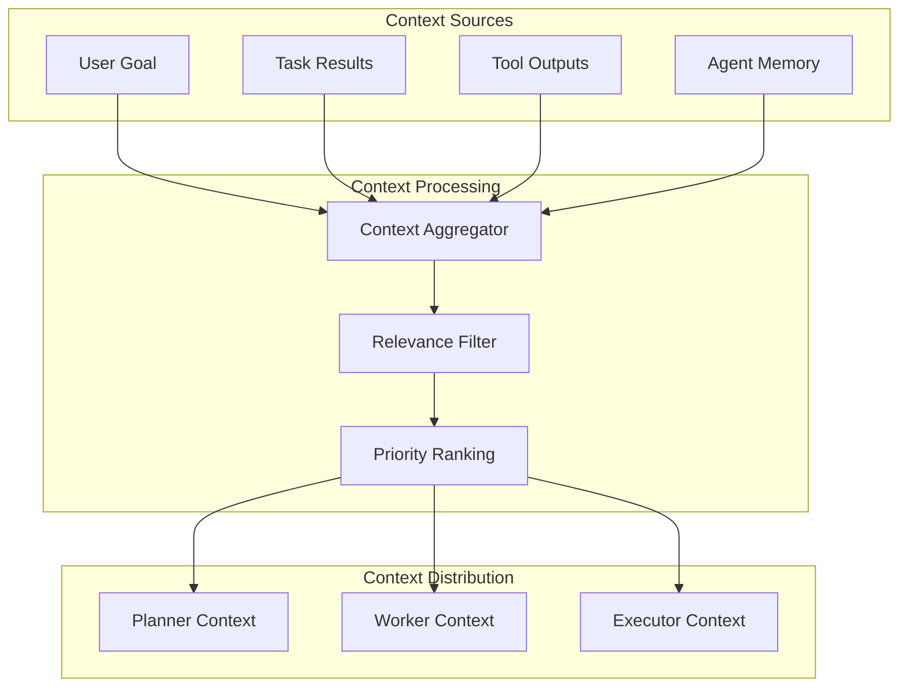

## State Management Patterns

### Workflow State

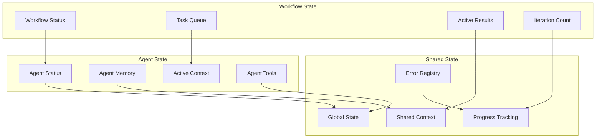

### State Synchronization

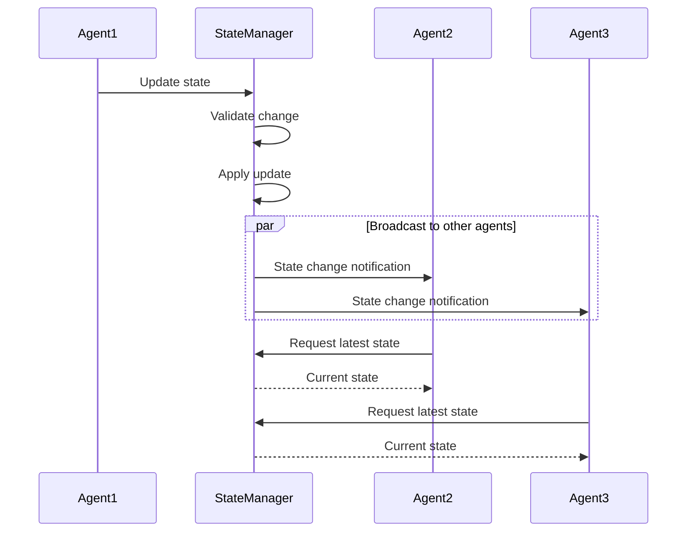

## Error Propagation Flow

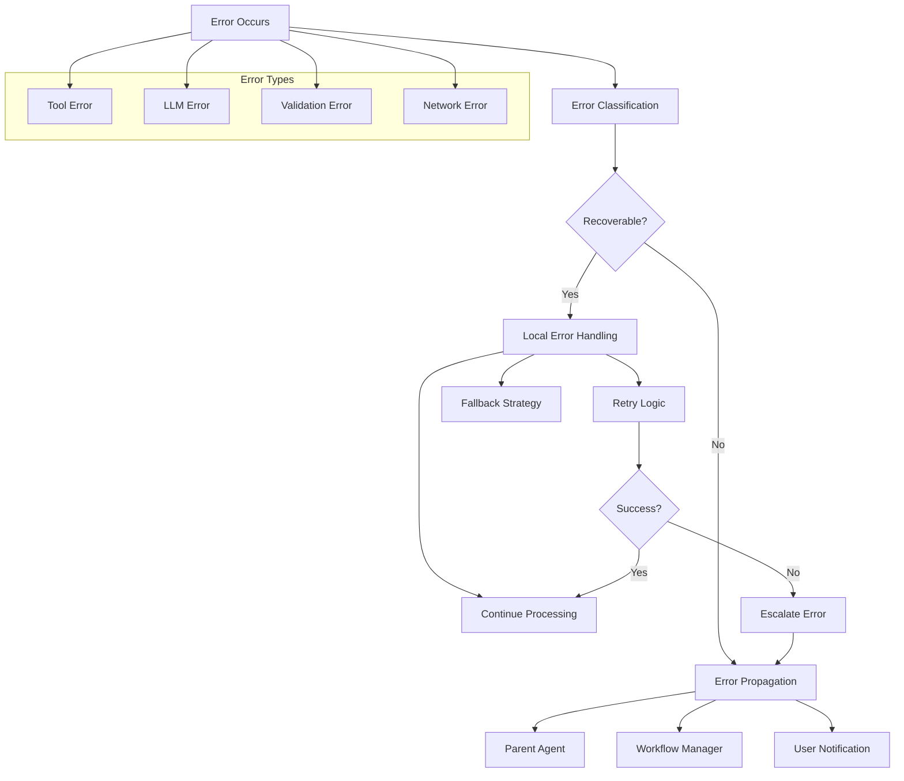

## Performance Optimization Patterns

### Data Caching

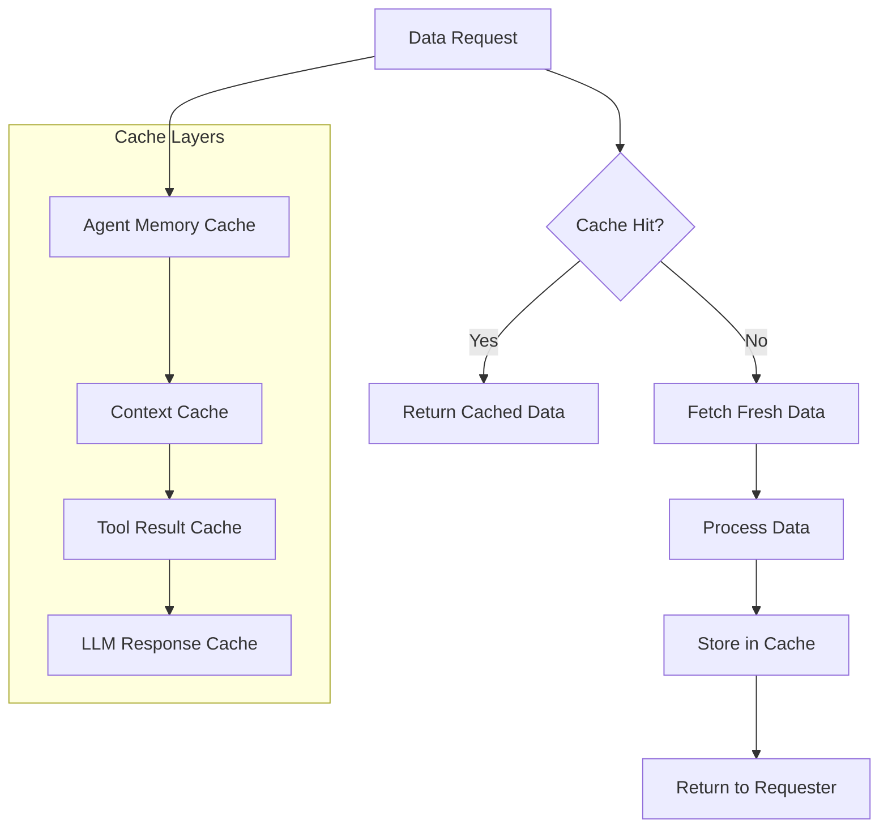

### Streaming Data Flow

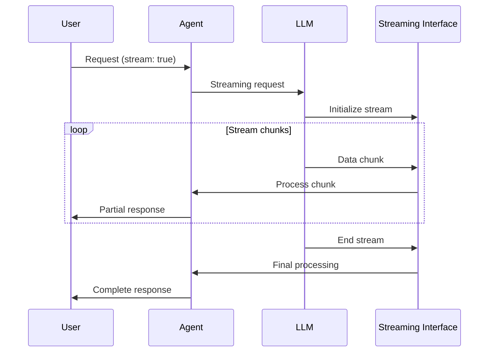

## Data Persistence Patterns

### Temporary Data

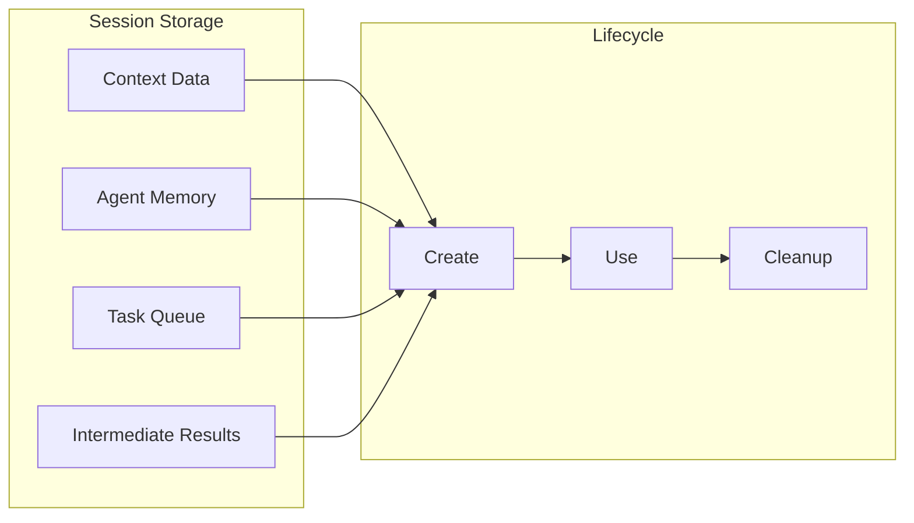

### Configuration Data

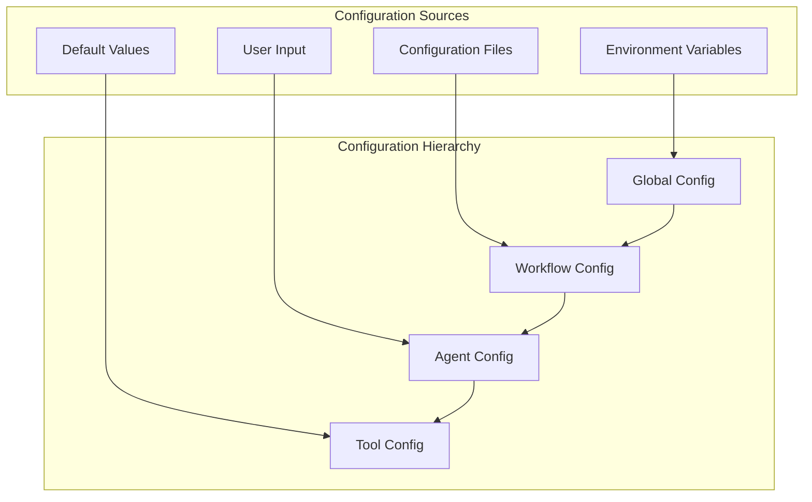

This data flow architecture ensures efficient, reliable, and observable data processing throughout the AI Agent SDK.