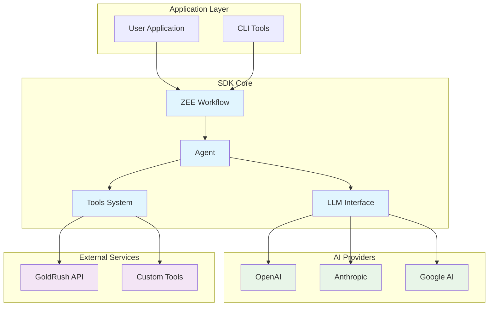
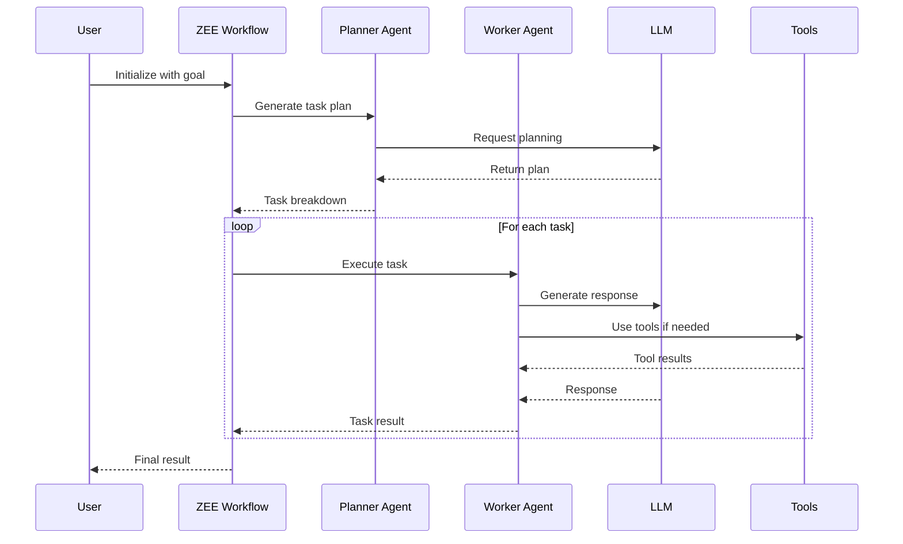
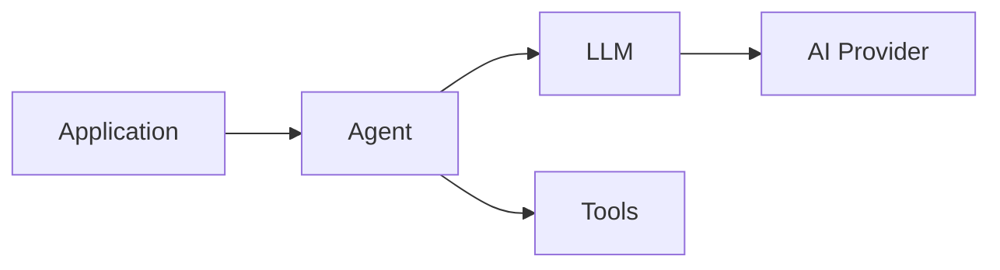
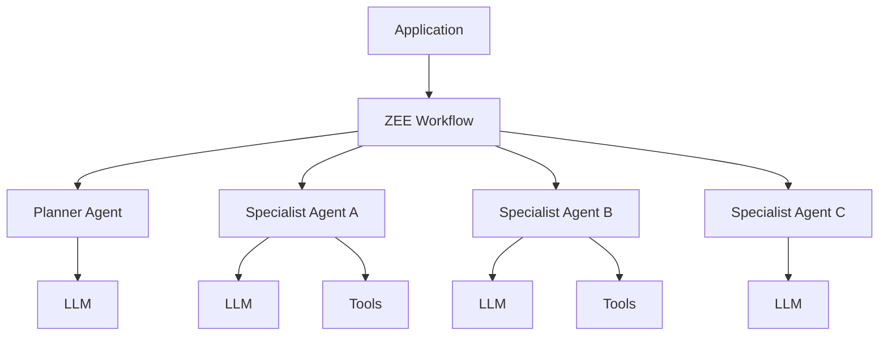
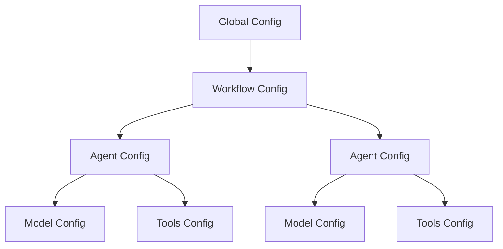

# System Architecture Overview

The AI Agent SDK is designed as a modular, composable framework for building autonomous AI agents. The architecture follows a layered approach with clear separation of concerns.

## High-Level Architecture

## Core Components

### 1. ZEE Workflow Engine
The orchestration layer that coordinates multiple agents to solve complex tasks.

**Key Features:**
- Multi-agent coordination
- Task decomposition and planning
- Context management
- Iteration control

### 2. Agent System
Individual AI agents with specific roles and capabilities.

**Key Features:**
- System prompts and instructions
- Tool integration
- Context-aware responses
- Temperature control

### 3. LLM Interface
Unified abstraction layer for different AI providers.

**Key Features:**
- Provider-agnostic API
- Model switching
- Response formatting
- Error handling

### 4. Tools System
Extensible framework for adding external capabilities.

**Key Features:**
- Tool registration
- Parameter validation
- Async execution
- Error handling

## Architecture Principles

### Modularity
Each component is designed as an independent module with well-defined interfaces, enabling easy composition and testing.

### Extensibility
The architecture supports adding new providers, tools, and agent types without modifying core components.

### Type Safety
Built with TypeScript for compile-time type checking and enhanced developer experience.

### Provider Agnostic
Unified interface across different AI providers, allowing seamless switching between models.

## System Flow

## Deployment Patterns

### Single Agent
For simple use cases requiring one specialized agent:

### Multi-Agent Workflow
For complex tasks requiring coordination:

## Configuration Management

The SDK uses a hierarchical configuration system:

This architecture ensures scalability, maintainability, and flexibility for building sophisticated AI agent systems.