# Workflow Orchestration

ZEE Workflows provide sophisticated orchestration capabilities to coordinate multiple AI agents in solving complex tasks. This document details the orchestration mechanisms and patterns.

## Orchestration Overview

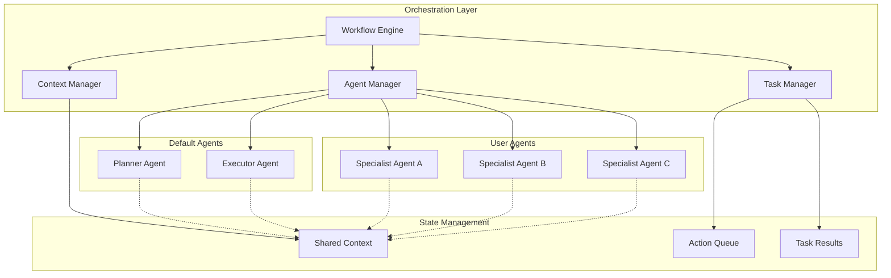

## Task Planning and Decomposition

The workflow uses a specialized planner agent to decompose complex goals into manageable tasks.

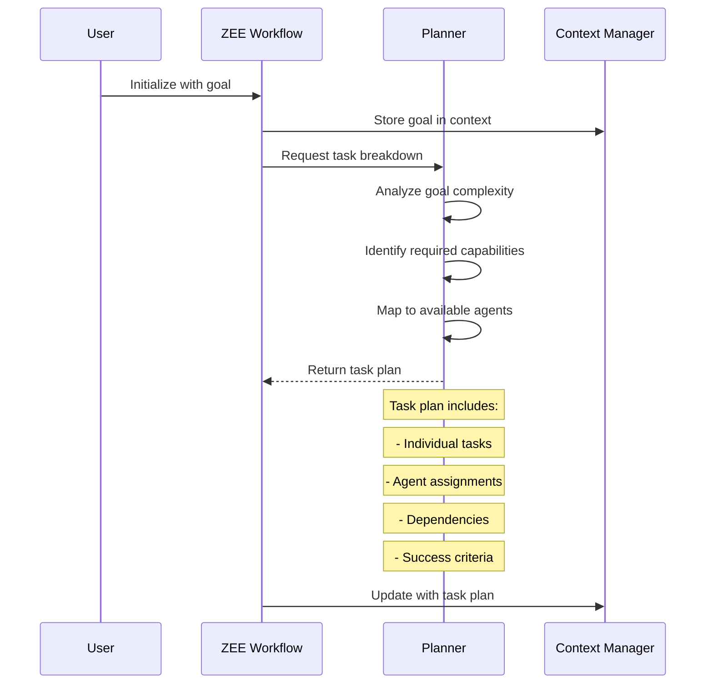

## Task Execution Patterns

### Sequential Execution

For tasks with strict dependencies:

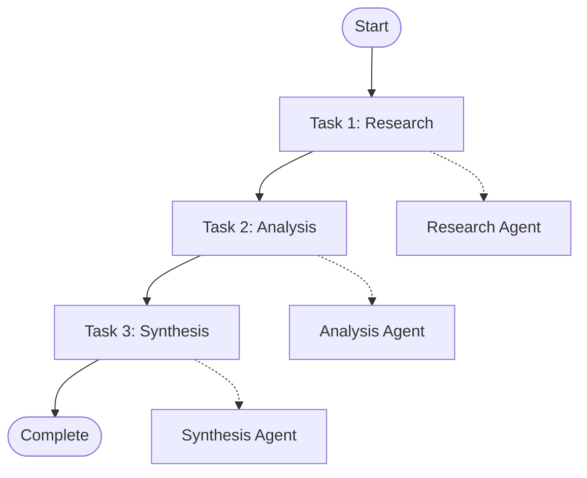

### Parallel Execution

For independent tasks:

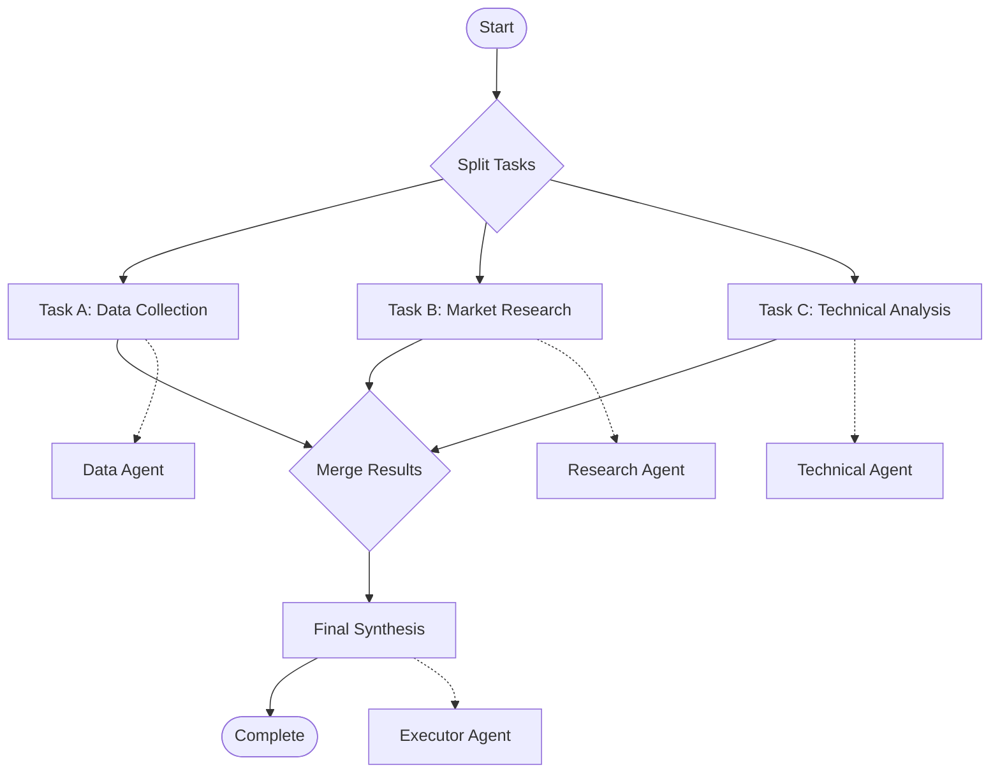

### Hybrid Execution

Combining sequential and parallel patterns:

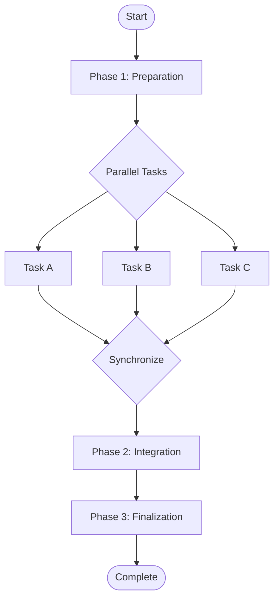

## Agent Communication Patterns

### Direct Communication

Agents communicate through shared context:

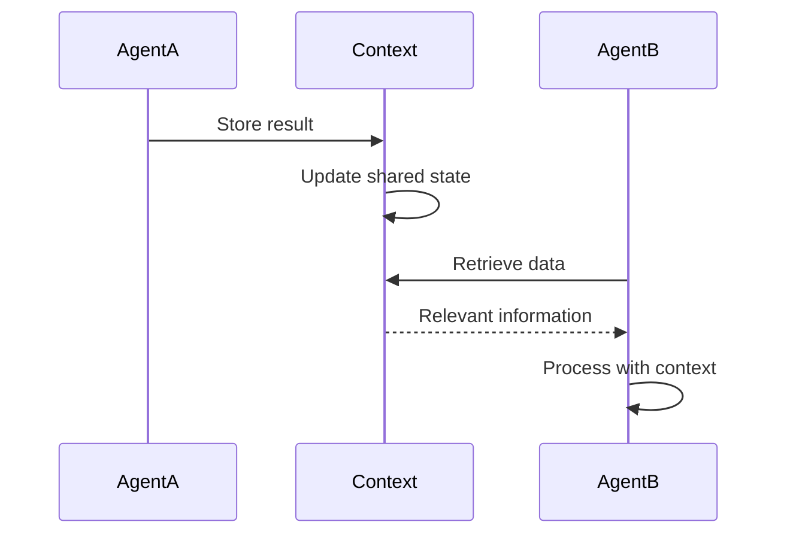

### Mediated Communication

Workflow orchestrator facilitates communication:

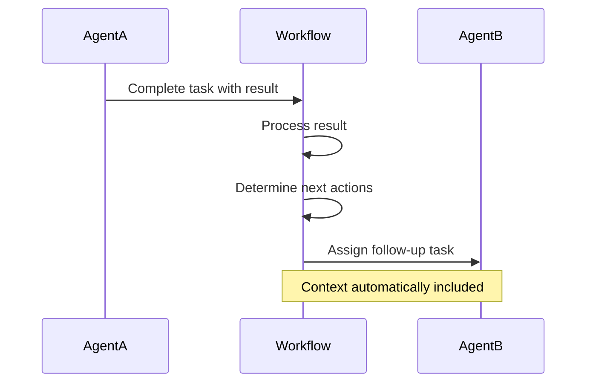

## Context Management

The context manager maintains shared state across all agents in the workflow.

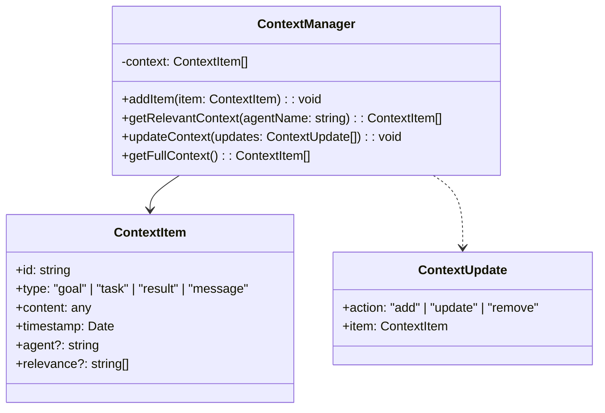

### Context Filtering

Context is filtered based on relevance to specific agents:

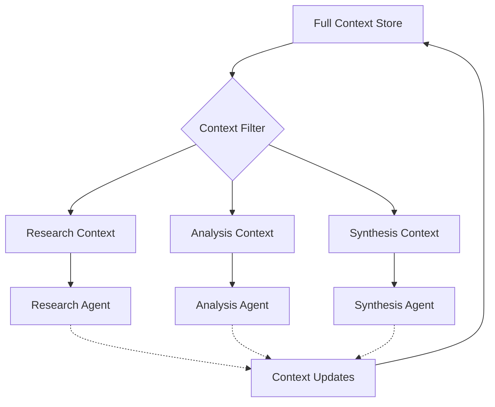

## Iteration Control

Workflows include sophisticated iteration control to prevent infinite loops and ensure progress.

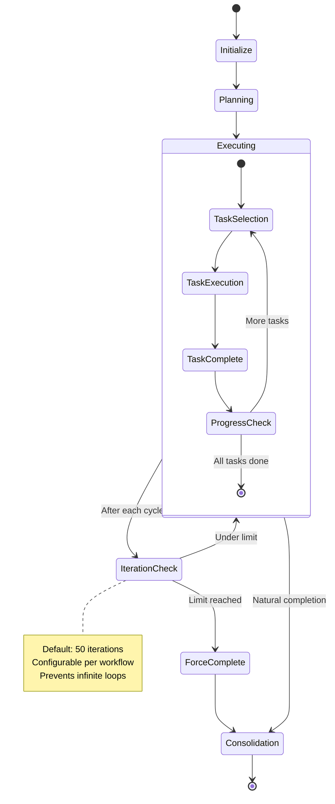

## Error Handling and Recovery

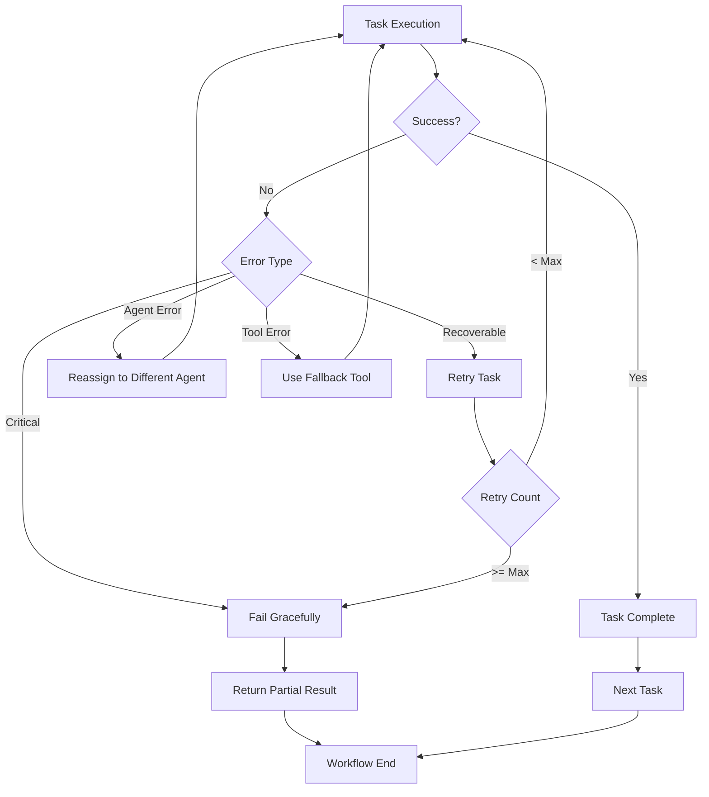

## Workflow Templates

### Research Workflow

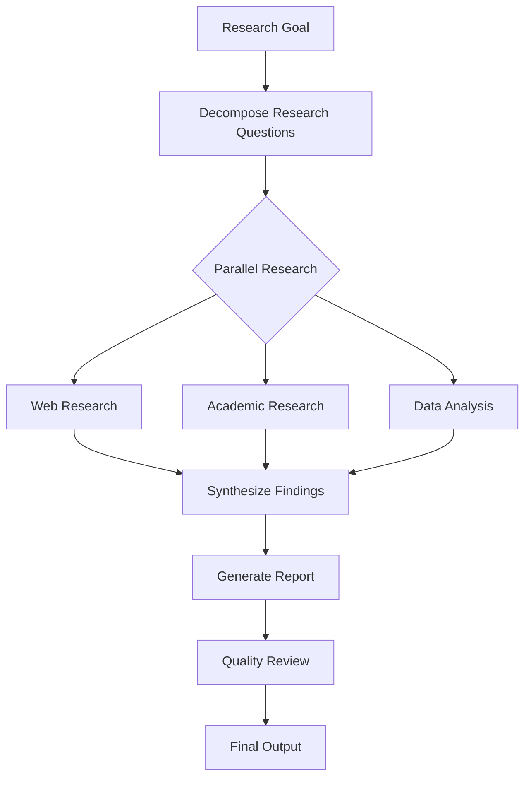

### Development Workflow

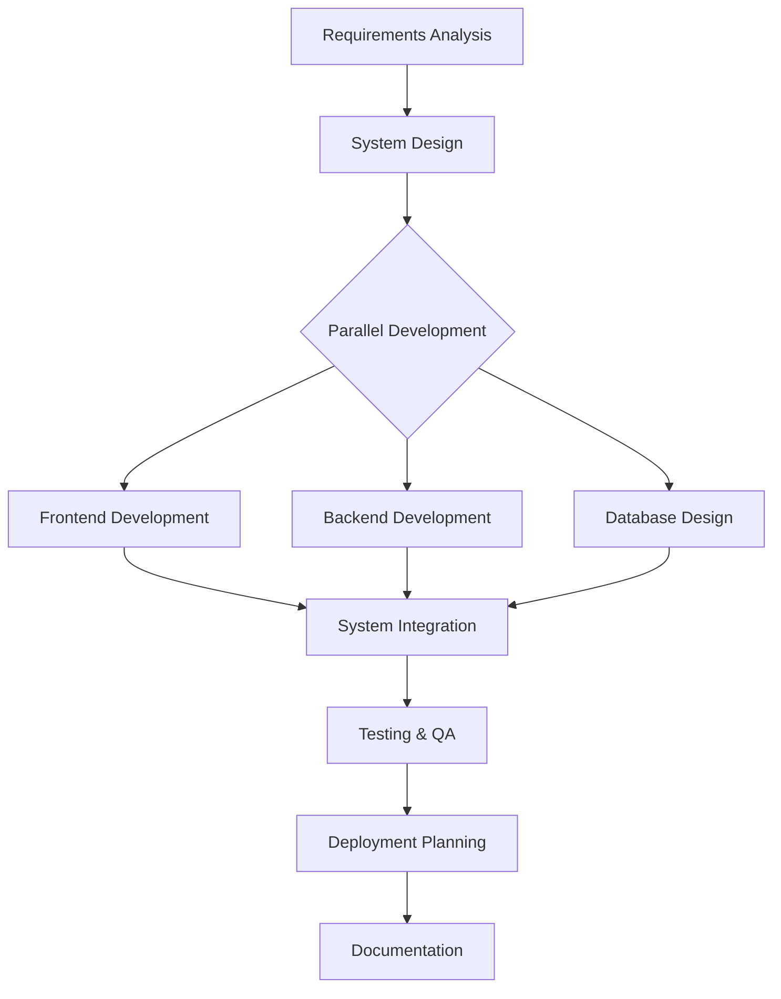

## Performance Optimization

### Agent Pool Management

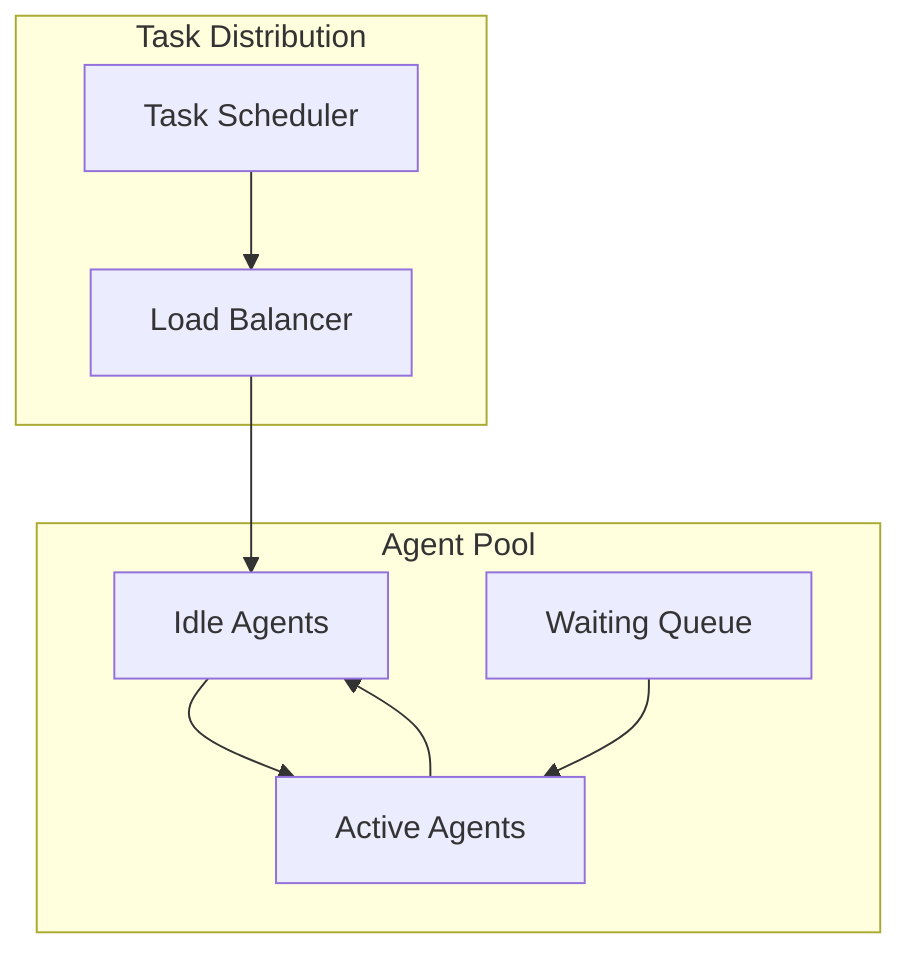

### Concurrent Execution

Tasks are executed concurrently when possible to optimize performance:

```mermaid
gantt
    title Workflow Execution Timeline
    dateFormat X
    axisFormat %s
    
    section Sequential
    Task 1    :0, 3
    Task 2    :3, 6
    Task 3    :6, 9
    
    section Parallel
    Task A    :0, 3
    Task B    :0, 4
    Task C    :0, 2
    Merge     :4, 5
```

This orchestration system enables powerful multi-agent workflows while maintaining control, observability, and error resilience.